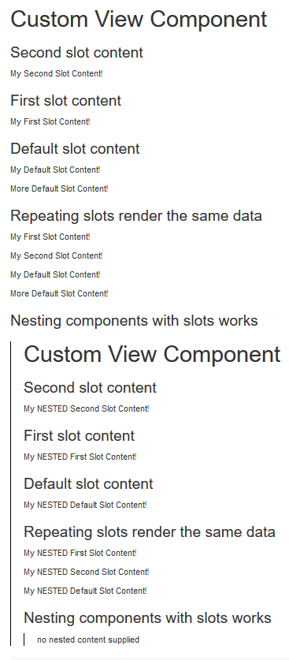

# Feature Proposal

Provide a built-in or otherwise framework supplied mechanism for View Components, when rendered via a tag helper, to render user-supplied child content that can be injected into the View Component's view template in pre-defined locations


# Use Case

When building component based presentation a number of useful features present in other component inspired frameworks are missing in Mvc:

* The ability to render user supplied child content from its invocation location in the component template
* The ability to mark and control placement of multiple elements of user supplied child content in the component template
* The ability to show default content if user supplied content was not provided
* Child content mechanism is supplied and supported by the framework, standardizing syntax and usage.

Allowing view components to accept child content provides new ways to build complex component driven presentation.

## Use Case Example

Within some calling view, instantiating a View Component via a tag helper and supplying child content:

Calling View:
```html
<vc:custom-view-component>
    <p>My Default Slot Content!</p>
    <p vc:slot="first">My First Slot Content!</p>
    <p vc:slot="second">My Second Slot Content!</p>

    <vc:custom-view-component vc:slot="nested">
        <p>My NESTED Default Slot Content!</p>
        <p vc:slot="first">My NESTED First Slot Content!</p>
        <p vc:slot="second">My NESTED Second Slot Content!</p>
    </vc:custom-view-component>

    <p>More Default Slot Content!</p>
</vc:custom-view-component>
```

The ViewComponents view template would provide the slot mechanism to place the user defined child content:

View Component Template:
```html
<h1>Custom View Component</h1>

<h3>Second slot content</h3>
<vc:slot name="second"><p>please supply a value for my second slot</p></vc:slot>

<h3>First slot content</h3>
<vc:slot name="first"><p>please supply a value for my first slot</p></vc:slot>

<h3>Default slot content</h3>
<vc:slot><p>please supply a value for my default slot</p></vc:slot>

<h3>Repeating slots render the same data</h3>
<vc:slot name="first">please supply a value for my first slot</vc:slot>
<vc:slot name="second">please supply a value for my second slot</vc:slot>
<vc:slot><p>please supply a value for my default slot</p></vc:slot>

<h3>Nesting components with slots works</h3>
<div style="border-left:1px solid black;padding-left:20px;">
    <vc:slot name="nested">no nested content supplied</vc:slot>
</div>
```

The View Component slotting mechanism will take care of rendering the user supplied child content into the correct slots in the View Component's user defined slot locations. Example output of the following:




# Inspiration

Content slotting or otherwise rendering user supplied child content in a parent template is a known and useful pattern seeing fair usage today:

* Web Component Slots (MDN): https://developer.mozilla.org/en-US/docs/Web/Web_Components/Using_templates_and_slots
* vuejs Slots: https://vuejs.org/v2/guide/components-slots.html
* Angular Template Outlet: https://angular.io/api/common/NgTemplateOutlet

Primary insipriation is from the web component HTML templates spec

# Requirements

Some potential requirements determined while researching this proposal:

* View Component slots should re-use the existing View Component tag helper ```<vc:[component_kebab_case_name]>```
* A new tag helper MUST be introduced (`<vc:slot>`) to mark locations in a View Component's view template where user supplied content can be placed
* User supplied child content within the body of the View Component Tag Helper MUST be optional
* All existing view attribute binding expression features MUST continue to work
* The View Component slotting mechanism MUST properly handle nested View Component Tag Helpers and View Component slots to any arbitrary depth in user supplied child content
* The View Component slotting mechanism MUST only support a single unamed "default" slot. Multiple unnamed View Component slot behavior MUST be either undefined or explicitly cause exception/error
* Users MUST be able to target zero or more named View Component slots within their supplied child content, whether or not a named slot exists in the View Component's view template.

# Experimental Implementation

To facilitate interest in this proposal a simple experiement was built to showcase the View Component Slotting mechanism in action. This experiement does not necessarly implement all identified requirements and is not guarenteed to be bug-free.

https://github.com/rdlaitila/AspNetCore.Mvc.ViewComponentSlots

what should work:

* Invoking a view component from a tag helper (see differences)
* Ability to supply arbitrary (non slot targeted) child content that will be placed in the parent View Component's default `<vc:slot>`
* Ability to supply slot targeted child content that will be placed in a matching `<vc:slot>` element in the View Component's view template where a slot with attribute `name="[slot_name]"` exists (ex: `<vc:slot name="some-slot"`>)
* Ability for View Component Slots to render default content if no user supplied child content targeting that slot was supplied.
* Ability to render nested View Component Tag Helpers and slots
* tag parameter expression binding within user supplied child content

differences:

* Due to the inability to hook into the existing [View Component Tag Helper](https://docs.microsoft.com/en-us/aspnet/core/mvc/views/view-components?view=aspnetcore-2.1#invoking-a-view-component-as-a-tag-helper), a custom View Component Tag Helper was built that can invoke a view component by the tag elements name in either `kebab-case` or `PascalCase` where the tag contains attribute `vc` (ex: `<my-custom-component vc>` or `<MyCustomComponent vc>`)
* slot elements are named `<vc:slot>` as well as the slot selector attribute  `vc:slot="[name]"`simply to match the existing View Component Tag Helper naming convention `<vc:[component-kebab-name]>` for consistency. There is no reason we could not adopt the current web component slot naming convension, or using some other name entirly.

# Author's Contribution

Unfortunatly I will be time limited to focus on a core contribution of View Component Slots to aspnet/Mvc and don't posses deep enough knolwedge of contribution guidelines or the Mvc sources to properly facilitate implementation of this proposal.

I can however allocate some time to improve the [experimental proposal implementation](https://github.com/rdlaitila/AspNetCore.Mvc.ViewComponentSlots) as needed and respond to community issues and pull requests on a best-effort basis. I hope the experimental implementation can validate that this use case is valid and valuable to others.

# Community Contribution

I would be excited to see community members either help improve the example implementation or help propose how to best implement such a feature into the Mvc core.


